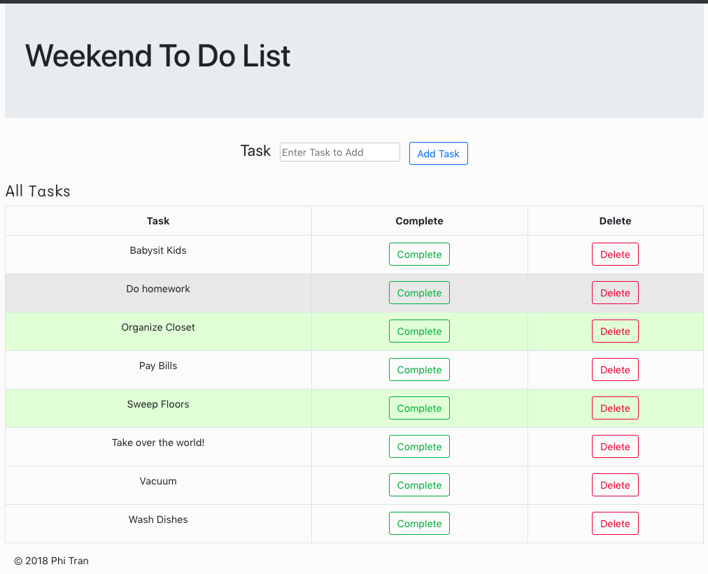

# To Do List
This project collects your tasks and displays it as a list.  You'll be able to track which tasks are completed and then be able to delete it.

## Built With
* JavaScript
* jQuery
* Node
* Express
* PostgreSQL
* Bootstrap

## Getting Started

### Prerequisites
Before you get started, make sure you have the following software installed on your computer:

- Download this project
- [Node.js](https://nodejs.org/en/)
- [PostrgeSQL](https://www.postgresql.org/)

### Create Database and Table
Create a new database called `weekend_to_do_app` and create a `weekend_to_do_app` table:

```SQL
CREATE TABLE weekend_to_do_app (
	id serial primary key,
	task varchar(120) not null,
	completed boolean
);
```

### Installing
* Start postgres if not running already by using `brew services start postgresql`
* Run `npm start`
* Navigate to `localhost:5000`

### Screen Shot


## Completed Features
- [x] GET Route 
- [x] POST Route 
- [x] DELETE Route
- [x] PUT Route to toggle completed

### Author
* Phi Tran
